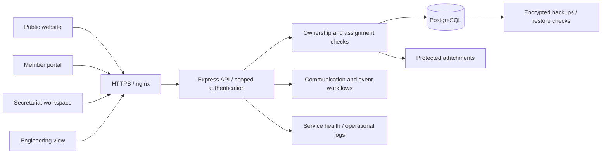

# AsklepiosMed — Paphos Medical Association

**Former Head Engineer · June 2022–July 2026 · Pro bono**

[Public website](https://asklepiosmed.org/) · [Portfolio overview](https://stelioszach.com/#asklepios)

I worked as Head Engineer for the Paphos Medical Association from June 2022 to July 2026, pro bono, and developed and donated AsklepiosMed to support its member services and administrative work. My role ended in July 2026.

The project has continued to evolve. The sections below describe its current capabilities and architecture, including development after my tenure. The platform now combines a public website, a member portal, secretariat workflows and a separate engineering view.

This is a public engineering case study. Application source, operational configuration and member records remain private.

## The problem

A professional association needs to publish information, support its members, organise events and handle sensitive requests without turning each workflow into a separate manual process. Those tasks also require different access boundaries: members should see their own records, the secretariat should manage its assigned work, and engineering access should not automatically reveal confidential case content.

## Current project capabilities

| Area                          | Implemented workflows                                                                                                             |
| ----------------------------- | --------------------------------------------------------------------------------------------------------------------------------- |
| Member access                 | Activation, mandatory profile review, verified contact-change flows, passkeys and recovery paths                                  |
| Information and communication | Public articles and announcements, member notifications and explicit communication preferences                                    |
| Secretariat publishing        | Private content drafts, preview, publication, revision restore and publication-conflict handling                                  |
| Events and learning           | Meeting invitations, conference participation, attendance records and issued participation certificates                           |
| Membership credentials        | Apple/Google Wallet membership cards with public status verification; membership verification is not medical-licence verification |
| Confidential casework         | Member submissions, encrypted attachments, assigned-secretariat access, messages, status history and linked requests for review   |
| Operations                    | Service monitoring, encrypted backups, restoration checks and documented recovery procedures                                      |

## Engineering approach

The application uses React, Express and PostgreSQL, with nginx and systemd on a VPS. Work spans the interface, API behaviour and the operational procedures needed to maintain a running service.

This is a logical view of the single-VPS application. Separate boxes describe responsibilities, not independent fault-tolerant machines. Member ownership and secretariat assignment govern confidential case access; the engineering view is not a blanket permission to read case content.

Security-sensitive operations use scoped authentication checks. Confidential case access is limited by ownership and assignment, rather than treating every administrator as entitled to read everything. Content publication handles competing edits, and communication workflows make consent, review and explicit approval visible.

Verification has included focused automated tests, synthetic end-to-end workflows, responsive browser checks and backup restoration exercises. These are practical checks of particular behaviours, not a claim that software can be proved bug-free.

## Outcome and evidence

The public website and documented member/administrative workflows form the delivered software artifact. This case study does not claim measured adoption, staff time saved, security certification or a clinical outcome: no independently audited figures for those outcomes are published here. Operational records, private screenshots and member data are not used as portfolio material.

## Boundaries

- This is professional-association software, not a clinical decision system or patient electronic-health-record platform.
- The deployment uses a single VPS; it is not a highly available multi-region architecture.
- Selected sensitive records and backups are encrypted. That does not mean whole-disk or end-to-end encryption of every datum.
- A Wallet membership result does not authenticate the physical holder or certify a medical licence. Native NFC and an independently verified native iOS application are not claimed.
- A linked request for review supports a workflow; it does not establish statutory disciplinary or appeals authority.
- Technical privacy controls do not constitute a GDPR certification. Governance and retention decisions remain responsibilities of the association.

The [public platform](https://asklepiosmed.org/) can be viewed without access to member records. No private credentials, member data or production configuration are included in this portfolio repository.
